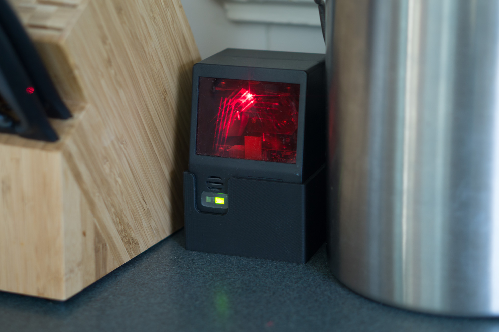

# Wunderscan

This repository is for a Wunderlist-connected scanner for adding spices or snacks that you have run out of to your shopping list.

## Building this Project

1. Copy the `.build_config.example` file as `.build_config` and replace the variables with your keys and info.
1. Run the `mix firmware` command to build the project.

## Using SSH With Nerves

1. SSH into the Pi using `ssh <ip> -p 8989`.
1. In the Erlang terminal, run the command `'Elixir.IEx':start().` to use Elixir's IEx.

## Official Nerves Resources

If you get stuck on any Nerves-related issues, the following resources are available:

  * Official docs: https://hexdocs.pm/nerves/getting-started.html
  * Official website: http://www.nerves-project.org/
  * Discussion Slack elixir-lang #nerves ([Invite](https://elixir-slackin.herokuapp.com/))
  * Source: https://github.com/nerves-project/nerves
